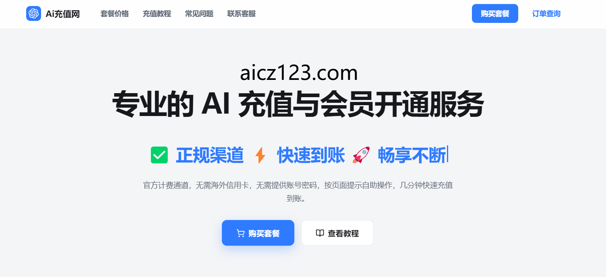
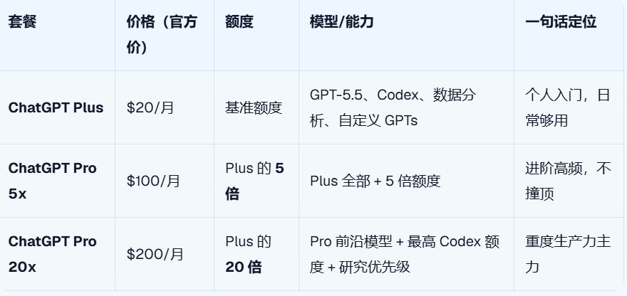
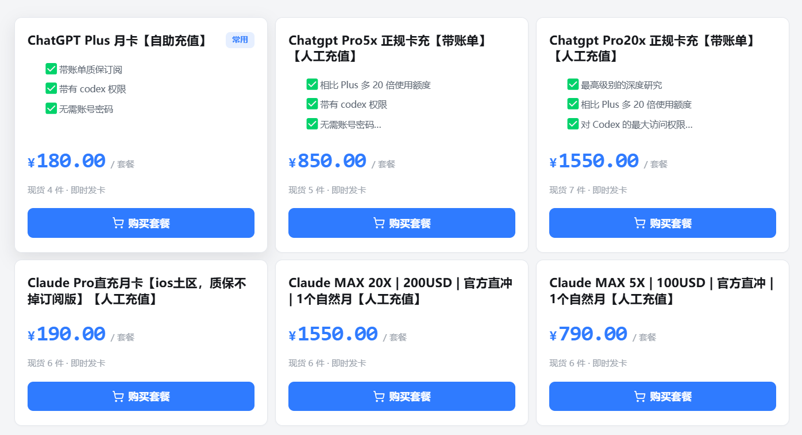

# ChatGPT Plus、Pro 5x、Pro 20x有什么区别？2026年三个套餐怎么选

**ChatGPT 现在 Plus、Pro 5x、Pro 20x 三个档，差几百上千块，到底差在哪？我该买哪个？** 网上要么只讲 Plus，要么把价格一列就完事，没人说清楚"我这种情况该选哪个"。这篇一次讲透。

先给一句话结论：**三个套餐的差别核心就两点——能用多少额度、能用哪些模型。** 你用得越狠、越依赖它干活，越往上选。下面展开。

## 三个套餐到底差在哪

先把三档摆在一起，一眼看清：

把这张表拆开说：

**额度** 是三档最直接的差别。Plus 是基准线，5x 给你 5 倍，20x 给你 20 倍。这里的"额度"包括对话次数、Codex 编程任务、图片生成这些资源。**你越容易撞到"今天额度用完了"的提示，就越该往上走。**

**模型和优先级** 是 20x 独有的硬货。Plus 和 5x 都是跑 GPT-5.5，差的只是用量；而 **Pro 20x 能调用 Pro 的前沿模型、拿到最高的 Codex 额度和研究优先访问**——前沿模型在排队高峰期还有优先级，不用跟人挤。

**功能上三档其实都很全**：Codex、高级数据分析、自定义 GPTs、增强记忆这些 Plus 就有了。所以**不要为了"解锁某个功能"去升级，三档的功能盘子是一样的，升级买的是"量"和"前沿模型"。**

## 关键澄清：5x、20x 不是新模型，是额度倍数

这是最容易误解的点，单独拎出来说。

**5x、20x 这个"x"指的是额度倍数，不是模型版本，也不是性能快几倍。** 不是说 20x 的回答质量是 Plus 的 20 倍，而是说**它给你的使用量是 Plus 的 20 倍**。

打个比方：Plus、Pro 5x、Pro 20x 就像同一家健身房的三种卡——月卡、季卡、年卡。器材都能用（功能一样），区别是你能进去的次数（额度）。20x 多出来的"前沿模型 + 优先级"，相当于年卡附送的私教时段，只有顶配才有。

所以选档的逻辑很简单：**先问自己一个月会撞几次额度上限，撞得越多越往上买。**

## 那我到底该选哪个？按人群对号入座

### 选 ChatGPT Plus（$20/月）的人

* **学生党、考研考公、写论文查资料**：偶尔问问题、改改文字、翻译润色，Plus 的额度绰绰有余
* **普通上班族**：写周报、做 PPT 大纲、改邮件、整理文档，一天用个几十次，撞不到顶
* **想先体验一下的新手**：不确定自己用不用得起来的，先开 Plus，**用满了再升级也不迟，没必要一上来就上 Pro**
* **偶尔写点代码的人**：日常小脚本、改 bug、问语法，Plus 的 Codex 额度够用

**一句话：你不是天天靠它干活，Plus 就是你的答案。**

### 选 ChatGPT Pro 5x（$100/月）的人

* **内容创作者 / 自媒体**：天天批量写文案、起标题、做选题，Plus 额度不够、20x 又用不满，5x 正好卡在中间
* **高频用 Codex 的开发者**：每天写代码、改项目、让它跑测试，但还没到全天候连轴转的程度
* **做副业、跑自动化的人**：把 ChatGPT 接进自己的工作流，每天稳定调用，需要比 Plus 更厚的额度垫底
* **从 Plus 升级上来的人**：Plus 已经天天撞顶，但又觉得 20x 太贵——**5x 就是为这种"中间状态"准备的**

**一句话：你天天用、还经常让它干活，但 20x 的量你吃不满，选 5x 最划算。**

### 选 ChatGPT Pro 20x（$200/月）的人

* **职业开发者 / 重度 Codex 用户**：整天让它跑大型重构、长时间任务、多项目并行，最高的 Codex 额度和前沿模型对你是刚需
* **靠 AI 吃饭的生产力主力**：ChatGPT 是你日常产出的核心工具，停一会儿都影响产出，额度和优先级不能将就
* **做研究、要前沿模型的人**：需要 Pro 前沿模型 + 研究优先访问，这是只有 20x 才给的
* **团队里的重度使用者**：一个人顶几个人的用量，5x 都天天爆，那 20x 的 20 倍额度才压得住

**一句话：你把它当生产力主力、整天重度跑，别犹豫，直接 20x。**

## 一句话选档清单

懒得看上面的，记住这三句：

* **偶尔用 → Plus（$20）**
* **天天用、但吃不满 → Pro 5x（$100）**
* **重度跑、靠它吃饭 → Pro 20x（$200）**

还有个实用建议：**拿不准就从低往高买。** 先开 Plus，真撞顶了再升 5x，5x 都天天爆再上 20x。**没必要一步到位买顶配，省下的钱够你用好几个月。**

## 想开通，国内卡在哪一步？

档位选好了，真正的麻烦才开始——**国内付不了钱**：

* 国内银联单标卡，OpenAI 直接拒
* 带 Visa/Mastercard 标识的国内双币卡，成功率不稳定，今天能付明天可能被拒
* App Store 订阅要美区 Apple ID + 美区礼品卡，前期准备繁琐
* 乱用虚拟信用卡，轻则支付失败，重则触发风控暂停账号

如果你手里有**海外发行的信用卡或绑了外币卡的 PayPal**，那最省事，直接在 OpenAI 官网选档订阅就行。

但大多数录友没有海外卡，这时候**靠谱的代充是最快的路子**。

## 国内没有海外卡？代充开通，三档都能开

如果你不想折腾海外卡、美区账号，代充是门槛最低的方式。但**一定要选靠谱的平台**，否则盗号、不到账都可能发生。

我自己用的是 PayAI.plus，**Plus、Pro 5x、Pro 20x 三个档都能代充**，流程是"支付拿激活码 → 官方页面激活"，**全程不需要提供 OpenAI 账号密码**，比较安全：

[www.aicz123.com](www.aicz123.com)

充值页面：

拿到卡密后按页面教程直接充值就行，网站有客服联系方式，**不确定自己该买哪档，直接问客服，把你的使用场景说清楚让他帮你参谋**。

## 常见问题

**ChatGPT Plus、Pro 5x、Pro 20x 最主要的区别是什么？**

核心就两点：使用额度和能调用的模型。Plus 是基准额度、跑 GPT-5.5；Pro 5x 是 Plus 的 5 倍额度；Pro 20x 是 20 倍额度，还能用 Pro 前沿模型、拿到最高的 Codex 额度和研究优先级。

**我到底该选哪个套餐？**

看使用强度。偶尔问问题、写写文档选 Plus；天天用、还经常让它跑代码或长任务、但没到全天候的程度，选 Pro 5x；把它当生产力主力、整天重度跑 Codex 和长任务，选 Pro 20x。

**Plus 够用吗，什么情况下才需要升级？**

日常聊天、写作、查资料、偶尔写点代码，Plus 完全够。只有当你频繁撞到额度上限、或者要长时间跑 Codex、大型重构这类任务时，才需要往 Pro 上升。

**Pro 5x 和 Pro 20x 差一倍钱，值不值？**

差在额度（5 倍 vs 20 倍）和模型/优先级。如果你 5x 经常用不满，就别上 20x；如果你 5x 都天天撞顶、或者靠它吃饭，那 20x 的额度和前沿模型就值这个价。

**5x、20x 是不是性能快几倍？**

不是。这个"x"是额度倍数，不是模型快几倍，也不是回答质量翻几倍。它指的是你能用的量，20x 就是 Plus 的 20 倍用量，外加前沿模型和优先级。

**国内没有海外卡，怎么开通这些套餐？**

三个档位都可以走支付宝/微信代充。选激活码模式的平台，自己在官方页面激活，全程不用交账号密码，封号风险低。PayAI.plus 亲测可用。

## 保护账号安全的几条铁律

不管你买哪一档、用哪种方式开通，这几点必须遵守：

* **绝对不要把 OpenAI 账号密码告诉任何人**
* 不在非官方页面输入你的 API Key
* 来源不明的虚拟卡一律不用
* 不要频繁切换登录地区、支付方式或设备
* 不在不可信平台登录你的 OpenAI 账号

## 总结

ChatGPT 三档套餐的选择逻辑，一句话收尾：**Plus 给入门、5x 给高频、20x 给重度，越靠它干活越往上买，拿不准就从低往高升。**
